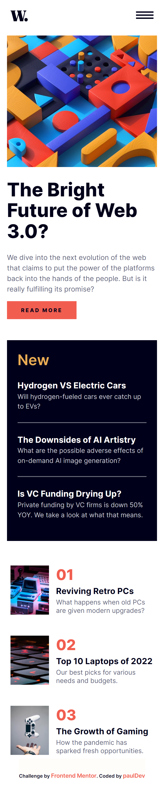

# Frontend Mentor - News homepage solution

This is a solution to the [News homepage challenge on Frontend Mentor](https://www.frontendmentor.io/challenges/news-homepage-H6SWTa1MFl). Frontend Mentor challenges help you improve your coding skills by building realistic projects. 

## Overview

🛑🛑🛑 WORK IN PROGRESS 🛑🛑🛑

### The challenge

Users should be able to:

- View the optimal layout for the interface depending on their device's screen size
- See hover and focus states for all interactive elements on the page

### Screenshot

### Links

- Solution URL: [Add solution URL here](https://your-solution-url.com)
- Live Site URL: [https://dev-paull.github.io/news-homepage/](https://dev-paull.github.io/news-homepage/)

## My process

🛑🛑🛑 WORK IN PROGRESS 🛑🛑🛑

- Started by analyzing the screenshots and thinking about how to structure the layout
- Designed mobile version first
- Adapted the page to desktop-sized window. 
- Built the navigation bar
- Optimized accessibility

### Built with

- Semantic HTML5 markup
- CSS custom properties
- Flexbox
- CSS Grid
- Mobile-first workflow

### What I learned

*Use this section to recap over some of your major learnings while working through this project. Writing these out and providing code samples of areas you want to highlight is a great way to reinforce your own knowledge.*

### Continued development

*Use this section to outline areas that you want to continue focusing on in future projects. These could be concepts you're still not completely comfortable with or techniques you found useful that you want to refine and perfect.*
